# 👋 Hi, there.

You can easily manage resources, workflows, queues and IM (instant messaging), and can also be customized as the basic service of any distribution system.

The technology stack includes Golang, TypeScript, MongoDB, Redis and Nats, etc.

Developed based on [Hertz](https://github.com/cloudwego/hertz) and [Ng-Zorro-Antd](https://github.com/NG-ZORRO/ng-zorro-antd).

As a basic service, Weplanx can provide:

* Basic functions included in conventional systems
* Distribution of dynamic configuration sync ups
* Can be friendly to support low-code mongodb RESTFul
* Angular and Golang development support libraries for business customization

Weplanx architecture for medium-light applications, but needs to run on Kubernetes.

[Rancher K3s](https://www.rancher.com/products/k3s) recommended for deploying lightweight K8s, also need to prepare these:

* Computing node
  * At least 3 nodes(2C4G) nodes form a K3s cluster, or 7 nodes are required for full self-host
* MongoDB
  * Recommended version > = 5.0 (supports Time series)
  * Production environment at least 2C4G replica cluster
  * Atlas or public cloud can be preferred, self-built recommendation Percona Distribution for MongoDB
* Redis
  * Recommended > = 256M
  * Redis Cloud or public cloud can be preferred
* Nats
  * Need to enable JetStream, [Helm](https://docs.nats.io/running-a-nats-service/nats-kubernetes) can be deployed to this cluster

### Case Overview



<figure><figcaption></figcaption></figure>



<figure><figcaption></figcaption></figure>



<figure>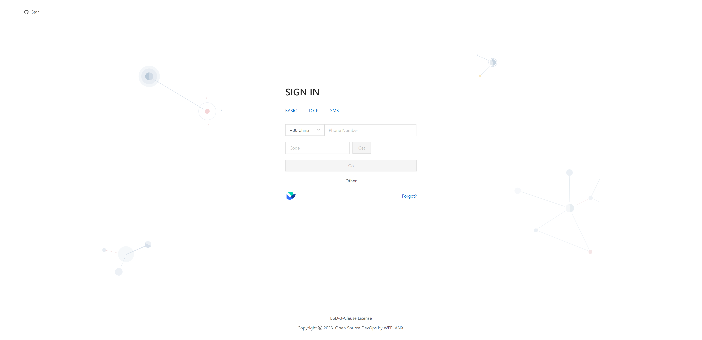<figcaption></figcaption></figure>



<figure>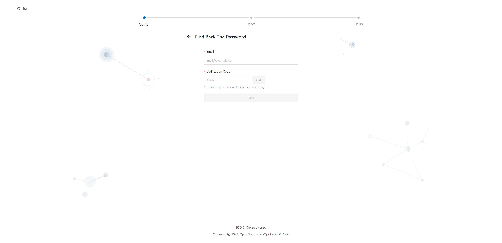<figcaption></figcaption></figure>





<figure>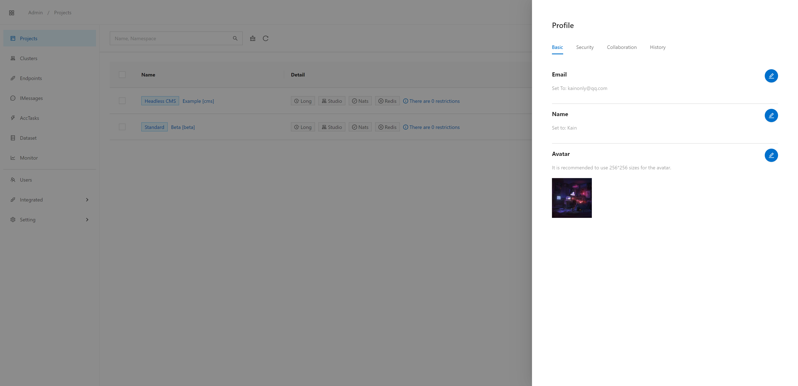<figcaption></figcaption></figure>



<figure>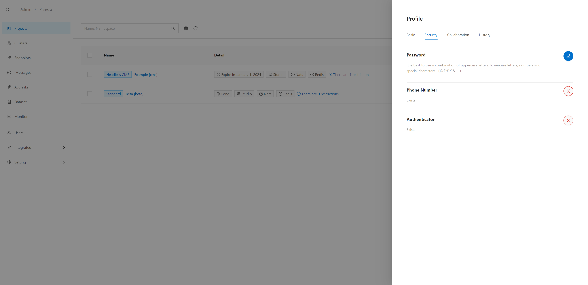<figcaption></figcaption></figure>



<figure>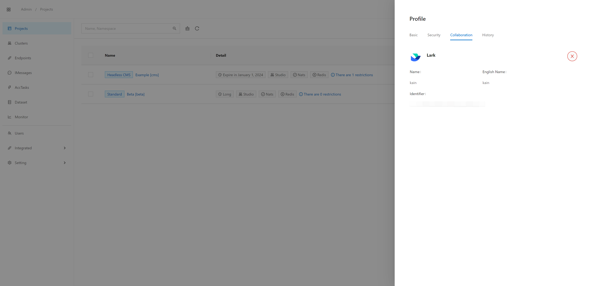<figcaption></figcaption></figure>



<figure>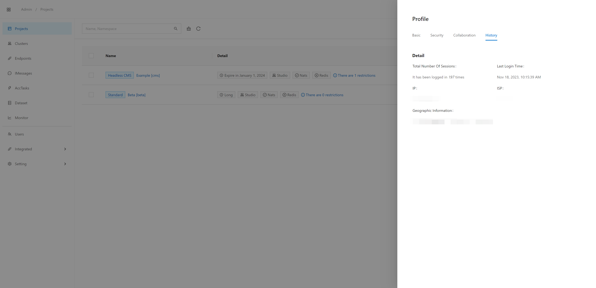<figcaption></figcaption></figure>





<figure>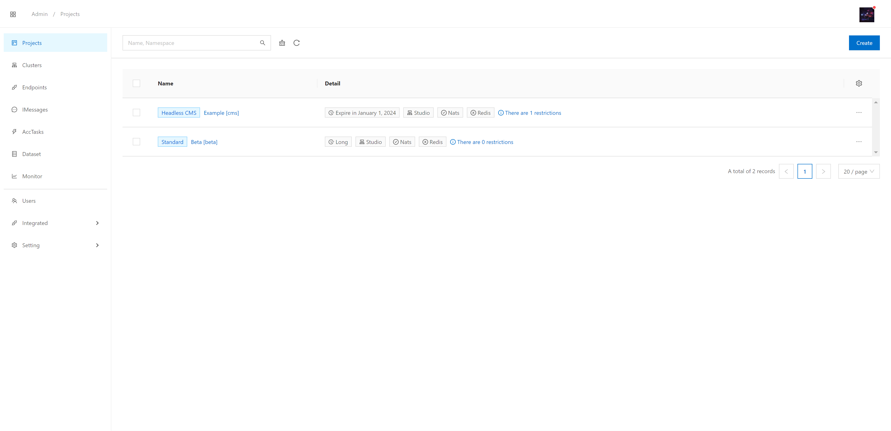<figcaption></figcaption></figure>



<figure>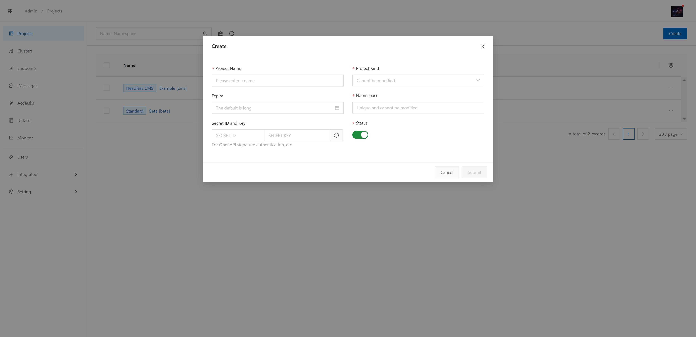<figcaption></figcaption></figure>



<figure><figcaption></figcaption></figure>



<figure>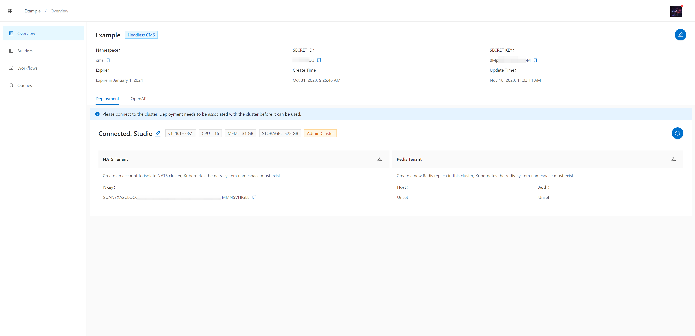<figcaption></figcaption></figure>





<figure>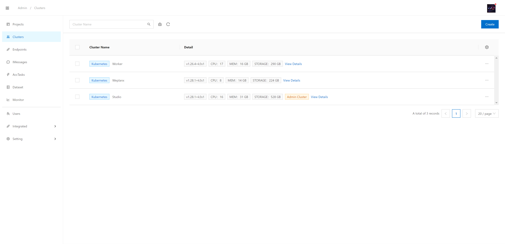<figcaption></figcaption></figure>



<figure>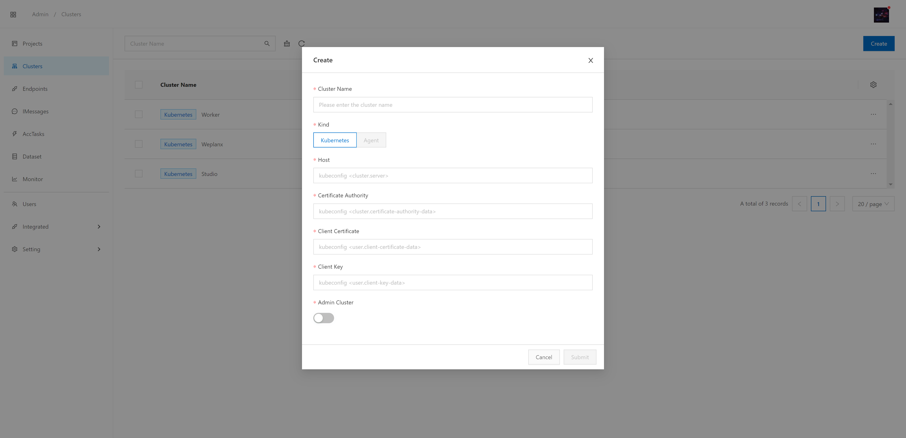<figcaption></figcaption></figure>



<figure>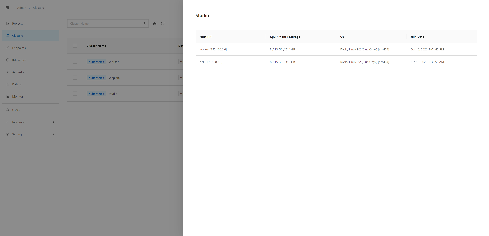<figcaption></figcaption></figure>





<figure><figcaption></figcaption></figure>



<figure><figcaption></figcaption></figure>



<figure><figcaption></figcaption></figure>





<figure><figcaption></figcaption></figure>



<figure><figcaption></figcaption></figure>



<figure><figcaption></figcaption></figure>



<figure><figcaption></figcaption></figure>



<figure><figcaption></figcaption></figure>



<figure><figcaption></figcaption></figure>





<figure><figcaption></figcaption></figure>



<figure><figcaption></figcaption></figure>



<figure><figcaption></figcaption></figure>



<figure><figcaption></figcaption></figure>



<figure><figcaption></figcaption></figure>



<figure><figcaption></figcaption></figure>





<figure><figcaption></figcaption></figure>




<figure><figcaption></figcaption></figure>



<figure><figcaption></figcaption></figure>



<figure><figcaption></figcaption></figure>





<figure><figcaption></figcaption></figure>



<figure><figcaption></figcaption></figure>



<figure>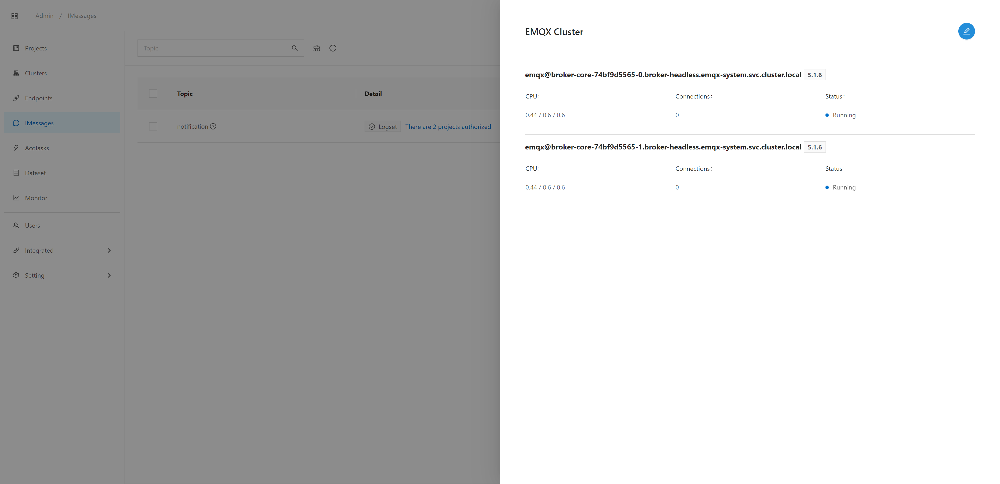<figcaption></figcaption></figure>



<figure><figcaption></figcaption></figure>



<figure><figcaption></figcaption></figure>



<figure><figcaption></figcaption></figure>





<figure><figcaption></figcaption></figure>



<figure><figcaption></figcaption></figure>



<figure>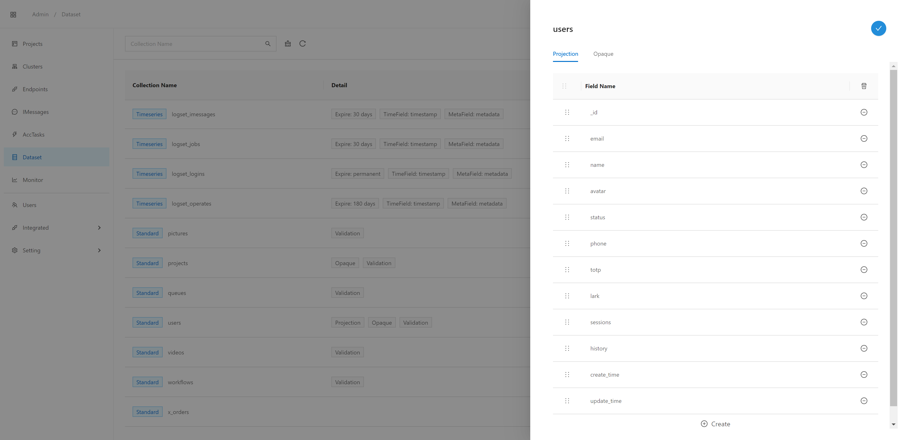<figcaption></figcaption></figure>



<figure><figcaption></figcaption></figure>






APM and RUNTIME have used Elastic APM solution


<figure><figcaption></figcaption></figure>



<figure><figcaption></figcaption></figure>



<figure><figcaption></figcaption></figure>





<figure><figcaption></figcaption></figure>




<figure><figcaption></figcaption></figure>



<figure><figcaption></figcaption></figure>



<figure><figcaption></figcaption></figure>





<figure><figcaption></figcaption></figure>



<figure><figcaption></figcaption></figure>



<figure><figcaption></figcaption></figure>



<figure><figcaption></figcaption></figure>



<figure><figcaption></figcaption></figure>





<figure><figcaption></figcaption></figure>



<figure><figcaption></figcaption></figure>



<figure><figcaption></figcaption></figure>



<figure><figcaption></figcaption></figure>


