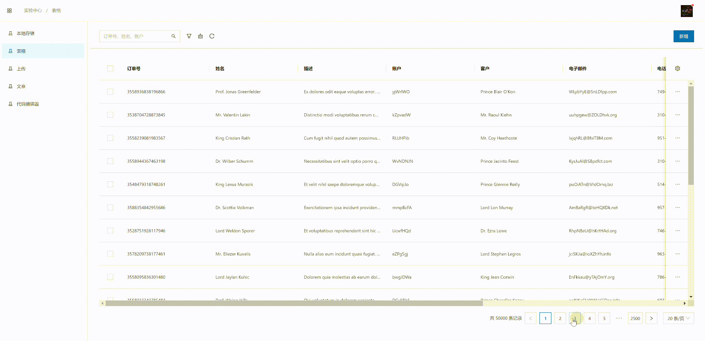
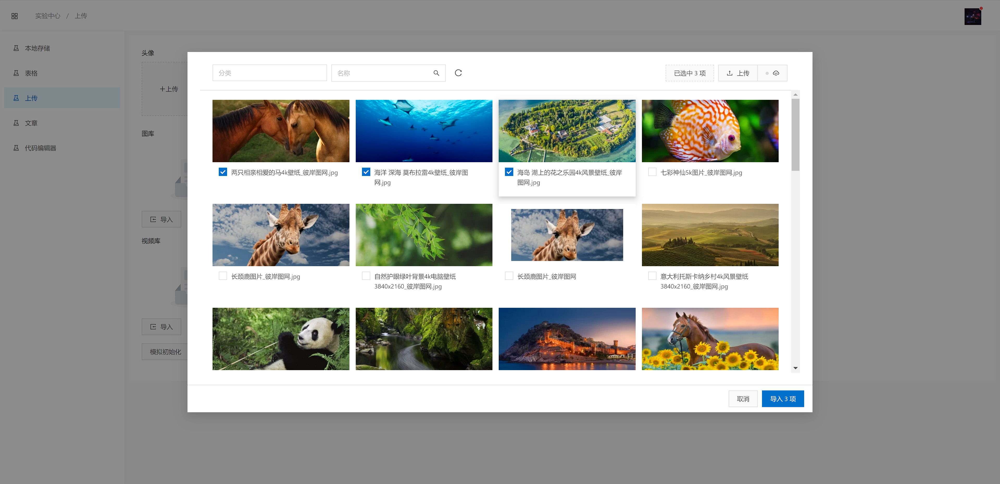
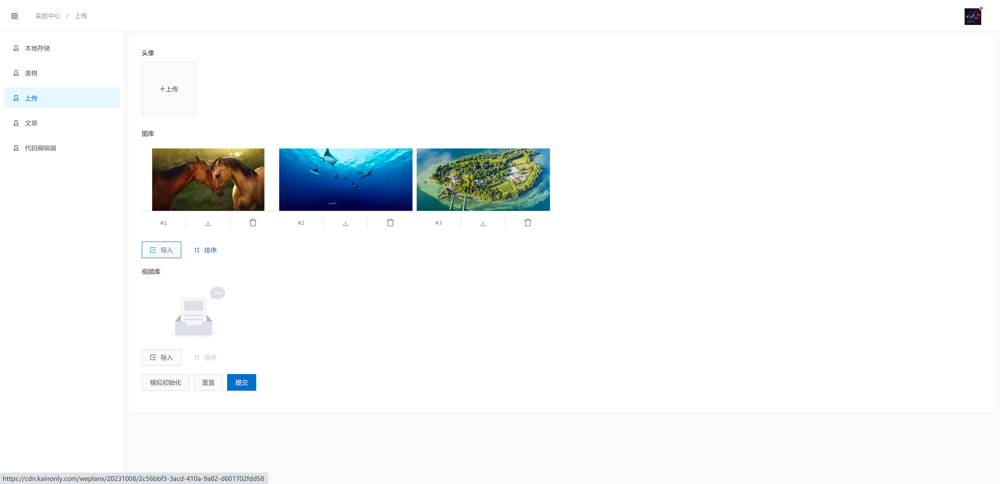
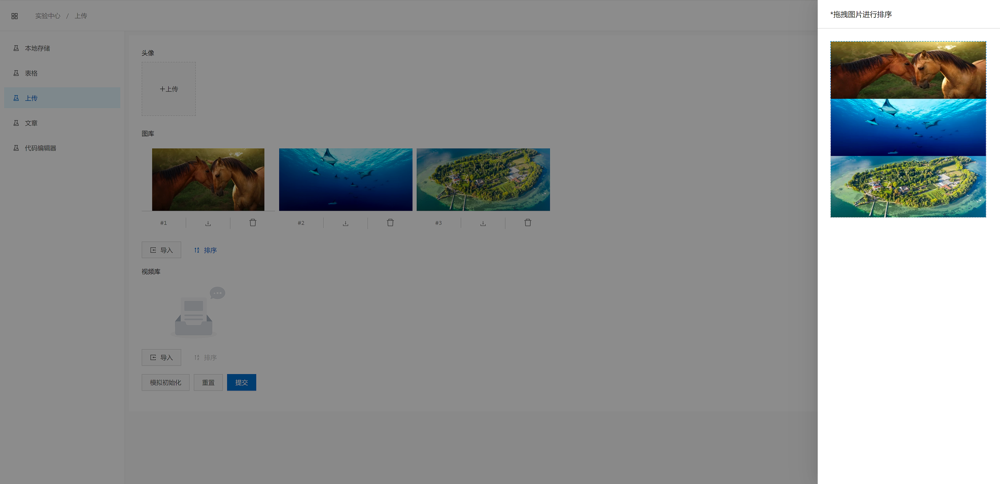

---
layout:
  title:
    visible: true
  description:
    visible: false
  tableOfContents:
    visible: true
  outline:
    visible: true
  pagination:
    visible: true
---

# Integration

### Keyword

```html
<wpx-keyword></wpx-keyword>
```

* **@Input({ required: true }) wpxModel!: WpxModel\<T>** universal model
* **@Input({ required: true }) wpxKeys!: string\[]** keyword fields
* **@Input() wpxWidth: number** width, default `220` px
* **@Input() wpxPlaceholder: string** prompt filling, default ` `` `
* **@Output() wpxSubmit: EventEmitter\<void>** submit event

Example: project experiment/table, used in dynamic list or dynamic table

```html
<wpx-keyword
  [wpxModel]="model"
  [wpxKeys]="['no', 'name', 'account']"
  (wpxSubmit)="getData()"
  wpxPlaceholder="订单号、姓名、账户"
></wpx-keyword>
```

### Toolbox

```html
<wpx-toolbox></wpx-toolbox>
```

* **@Input({ required: true }) wpxModel!: WpxModel\<T>** universal model
* **@Input() wpxSearchHeight: number** height, default `340` px
* **@Input() wpxSearchForm?: FormGroup** custom search FormGroup
* **@Input() wpxSearchTitle?: TemplateRef\<Any>** custom search panel title, default `Search`
* **@Output() wpxClear: EventEmitter\<void>** clear search event
* **@Output() wpxRefresh: EventEmitter\<void>** refresh event

Example: project _experiment/table_, used in dynamic list or dynamic table



```html
<wpx-toolbox [wpxModel]="model" [wpxSearchForm]="form" (wpxClear)="clear()" (wpxRefresh)="getData()">
  <form *ngIf="form" nz-form id="search" [formGroup]="form" (wpxSubmit)="search($event)">
    <nz-row [nzGutter]="[16, 16]">
      <nz-col [nzSpan]="6">
        <nz-form-item>
          <nz-form-label>订单号</nz-form-label>
          <nz-form-control>
            <input nz-input formControlName="no" />
          </nz-form-control>
        </nz-form-item>
      </nz-col>
      <nz-col [nzSpan]="6">
        <nz-form-item>
          <nz-form-label>姓名</nz-form-label>
          <nz-form-control>
            <input nz-input formControlName="name" />
          </nz-form-control>
        </nz-form-item>
      </nz-col>
      <nz-col [nzSpan]="6">
        <nz-form-item>
          <nz-form-label>账户</nz-form-label>
          <nz-form-control>
            <input nz-input formControlName="account" />
          </nz-form-control>
        </nz-form-item>
      </nz-col>
    </nz-row>
  </form>
</wpx-toolbox>
```



```typescript
@Component({
  selector: 'x-table',
  templateUrl: './table.component.html'
})
export class TableComponent implements OnInit {
  model!: WpxModel<Order>;
  form!: FormGroup;
  filter: Filter<Order> = {};

  constructor(
    private wpx: WpxService,
    private fb: FormBuilder,
    private modal: NzModalService,
    private message: NzMessageService,
    public orders: OrdersService
  ) {}

  ngOnInit(): void {
    this.form = this.fb.group({
      no: [],
      name: [],
      account: []
    });
    this.model = this.wpx.setModel<Order>('exp', this.orders);
    this.model.ready().subscribe(() => {
      this.getData();
    });
  }

  getData(refresh = false): void {
    if (refresh) {
      this.model.page = 1;
    }
    this.model.fetch(this.filter).subscribe(() => {
      console.debug('fetch:ok');
    });
  }

  clear(): void {
    this.form.reset();
    this.filter = {};
    this.getData();
  }

  search(data: Any): void {
    for (const [k, v] of Object.entries(data)) {
      if (v) {
        this.filter[k] = { $regex: `${v}` };
      }
    }
    this.getData();
  }
}
```



The effect is as shown:

<figure><figcaption></figcaption></figure>

### Table

```html
<wpx-table></wpx-table>
```

* **@Input({ required: true }) wpxModel!: WpxModel\<T>** universal model
* **@Input({ required: true }) wpxColumns!: WpxColumn\<T>\[]** table columns definition
* **@Input({ required: true }) wpxAction!: TemplateRef<{ $implicit: AnyDto }>** custom action panel
* **@Input() wpxTitle?: TemplateRef\<void>** custom title
* **@Input() wpxExtra?: TemplateRef\<void>** custom extra
* **@Input() wpxX?: string** fixed width
* **@Input() wpxBodyStyle: NgStyleInterface | null** custom card style, default `{ height: 'calc(100% - 64px)' }`
* **@Output() wpxChange: EventEmitter\<void>** update event

For example. The project _experiment/table_ has a complete demonstration, the effect is as follows:

<figure><figcaption></figcaption></figure>

### Upload Avatar

```html
<wpx-upload-avatar></wpx-upload-avatar>
```

* **@Input() wpxExt?: string** file extension suffix
* **@Input() wpxAccept: string\[]** allow accept
* **@Input() wpxFallback!: string** loading image

Use in form

```html
<wpx-upload-avatar
  wpxExt="image"
  [wpxAccept]="['image/jpeg', 'image/png']"
  [wpxFallback]="['assets', 'photon.svg'] | wpxAssets"
  formControlName="avatar"
>
</wpx-upload-avatar>
```

### Upload Transport

Batch upload and return the component of the progress bar

```html
<wpx-upload-transport></wpx-upload-transport>
```

* **@Input() wpxExt?: string** file extension suffix
* **@Input() wpxAccept: string\[]** allow accept, default `[]`
* **@Output() wpxChange: EventEmitter\<Transport\[]>** transports status
  * Transport
    * name `string`
    * percent `number`
    * file `NzUploadFile`

Used in FileBrowser

```html
<wpx-upload-transport
  *nzSpaceItem
  [wpxExt]="ext"
  [wpxAccept]="accept"
  (wpxChange)="upload($event)"
></wpx-upload-transport>
```

The effect is as shown:

<figure><figcaption></figcaption></figure>

### Richtext

WpxRichtextComponent integrated [editorjs](https://editorjs.io/) block editor

```html
<wpx-richtext></wpx-richtext>
```

* **@Input() wpxPlaceholder?: string**
* **@Input() wpxFallback?: string** loading image
* **@Input() wpxPictures?: (done: ResolveDone) => void** picture custom
* **@Input() wpxVideos?: (done: ResolveDone) => void** video custom

To use it, you need to load UMD scripts, and also support its extensions/plugins, for example:

```typescript
this.wpx.loadScript('editorjs', 'https://cdn.jsdelivr.net/npm/@editorjs/editorjs@2.27.2/dist/editorjs.umd.min.js', [
  'https://cdn.jsdelivr.net/npm/@editorjs/paragraph@2.10.0/dist/bundle.min.js',
  'https://cdn.jsdelivr.net/npm/@editorjs/header@2.7.0/dist/bundle.min.js',
  'https://cdn.jsdelivr.net/npm/@editorjs/delimiter@1.3.0/dist/bundle.min.js',
  'https://cdn.jsdelivr.net/npm/@editorjs/underline@1.1.0/dist/bundle.min.js',
  'https://cdn.jsdelivr.net/npm/@editorjs/nested-list@1.3.0/dist/nested-list.min.js',
  'https://cdn.jsdelivr.net/npm/@editorjs/checklist@1.5.0/dist/bundle.min.js',
  'https://cdn.jsdelivr.net/npm/@editorjs/table@2.2.2/dist/table.min.js',
  'https://cdn.jsdelivr.net/npm/@editorjs/quote@2.5.0/dist/bundle.min.js',
  'https://cdn.jsdelivr.net/npm/@editorjs/code@2.8.0/dist/bundle.min.js',
  'https://cdn.jsdelivr.net/npm/@editorjs/marker@1.3.0/dist/bundle.min.js',
  'https://cdn.jsdelivr.net/npm/@editorjs/inline-code@1.4.0/dist/bundle.min.js'
]);
```

The component reserves the customized way of gallery and video insertion.

You can wrap and customize the component. For example, define a `RichtextComponent` in _app/common/components_.

```typescript
@Component({
  selector: 'app-richtext',
  templateUrl: './richtext.component.html',
  providers: [
    {
      provide: NG_VALUE_ACCESSOR,
      useExisting: forwardRef(() => RichtextComponent),
      multi: true
    }
  ],
  encapsulation: ViewEncapsulation.None,
  changeDetection: ChangeDetectionStrategy.OnPush
})
export class RichtextComponent implements ControlValueAccessor {
  @ViewChild('footerRef') footerRef!: TemplateRef<Any>;
  @ViewChild(WpxRichtextComponent) richtext!: WpxRichtextComponent;

  placeholder = $localize`直接输入正文`;
  value: RichtextData | null = null;
  modalRef?: NzModalRef<WpxFilebrowserComponent<Any>>;

  onChanged!: (value: Any) => void;
  private onTouched!: () => void;

  constructor(
    private modal: NzModalService,
    private wpx: WpxService,
    @Optional() private pictures: PicturesService,
    @Optional() private videos: VideosService
  ) {}

  registerOnChange(fn: Any): void {
    this.onChanged = fn;
  }

  registerOnTouched(fn: Any): void {
    this.onTouched = fn;
  }

  writeValue(v: RichtextData): void {
    this.value = v;
  }

  get instance(): WpxFilebrowserComponent<WpxFile> {
    return this.modalRef?.componentInstance as WpxFilebrowserComponent<Any>;
  }

  openPictures = (done: ResolveDone): void => {
    this.modalRef = this.modal.create<WpxFilebrowserComponent<WpxFile>, WpxFilebrowserInput<WpxFile>>({
      nzClosable: false,
      nzBodyStyle: { height: '640px', padding: '8px 24px 24px' },
      nzWidth: 1200,
      nzContent: WpxFilebrowserComponent,
      nzData: {
        api: this.pictures,
        type: 'picture',
        fallback: this.richtext.wpxFallback!
      },
      nzFooter: this.footerRef,
      nzOnOk: instance => {
        const data = [...instance.ds.selection.values()][0];
        done({
          assets: this.wpx.assets,
          url: data.url + (!data.query ? '' : '?' + data.query)
        });
      }
    });
  };

  openVideos = (done: ResolveDone): void => {
    this.modalRef = this.modal.create<WpxFilebrowserComponent<WpxFile>, WpxFilebrowserInput<WpxFile>>({
      nzClosable: false,
      nzBodyStyle: { height: '640px', padding: '8px 24px 24px' },
      nzWidth: 1200,
      nzContent: WpxFilebrowserComponent,
      nzData: {
        api: this.videos,
        type: 'video',
        fallback: this.richtext.wpxFallback!
      },
      nzFooter: this.footerRef,
      nzOnOk: instance => {
        const data = [...instance.ds.selection.values()][0];
        done({
          assets: this.wpx.assets,
          url: data.url + (!data.query ? '' : '?' + data.query)
        });
      }
    });
  };
}
```

Then use it in the form

```html
<app-richtext formControlName="content"> </app-richtext>
```

### Categories

Repeated categories suite for implementation, integrated business logic with drawer categories lists and form editing

```html
<wpx-categories></wpx-categories>
```

* **@Input({ required: true }) wpxType!: string** The type field of collection categories, which can be used for picture, video, etc

### FileBrowser

Current implementation pictures and videos library integration, currently requires COS support

```html
<wpx-filebrowser></wpx-filebrowser>
```

* **@Input({ required: true }) wpxApi!: WpxApi\<T>** universal API
* **@Input({ required: true }) wpxType!: WpxFileType** type, can be `picture` or `video`
* **@Input({ required: true }) wpxFallback!: string** loding image
* **@Input() wpxForm?: (doc: AnyDto\<T>) => void** custom form
* **@Input() wpxTitle?: TemplateRef\<void>** custom title
* **@Input() wpxExtra?: TemplateRef\<void>** custom extra

The situation of each project may be different. The component only presets the main functions, so in actual use, the package assemble must be customized. The specific viewable console project is _app/filebrowser/\*_.

In addition, it also includes an input form component, which also needs to be customized by the package. The _app/common/components/filebrowser-input_ in the specific viewable console project.

```html
<wpx-filebrowser-input></wpx-filebrowser-input>
```

* **@Input({ required: true }) wpxValue!: string\[]** urls
* **@Input({ required: true }) wpxApi!: WpxApi\<T>** universal API
* **@Input({ required: true }) wpxType!: WpxFileType** type, can be `picture` or `video`
* **@Input({ required: true }) wpxFallback!: string** loding image
* **@Input() wpxHeight: number** custom height
* **@Input() wpxWidth: number** custom width
* **@Input() wpxLimit?: number** limit total
* **@Output() wpxValueChange: EventEmitter\<string\[]>** change event

Selecting a pictures or videos library will pop up a modal to select, as shown in the figure:



<figure><figcaption></figcaption></figure>



<figure><figcaption></figcaption></figure>



<figure><figcaption></figcaption></figure>



Finally, it can be customized for reservation integration of richtext editor.

```typescript
openPictures = (done: ResolveDone): void => {
  this.modalRef = this.modal.create<WpxFilebrowserComponent<WpxFile>, WpxFilebrowserInput<WpxFile>>({
    nzClosable: false,
    nzBodyStyle: { height: '640px', padding: '8px 24px 24px' },
    nzWidth: 1200,
    nzContent: WpxFilebrowserComponent,
    nzData: {
      api: this.pictures,
      type: 'picture',
      fallback: this.richtext.wpxFallback!
    },
    nzFooter: this.footerRef,
    nzOnOk: instance => {
      const data = [...instance.ds.selection.values()][0];
      done({
        assets: this.wpx.assets,
        url: data.url + (!data.query ? '' : '?' + data.query)
      });
    }
  });
};

openVideos = (done: ResolveDone): void => {
  this.modalRef = this.modal.create<WpxFilebrowserComponent<WpxFile>, WpxFilebrowserInput<WpxFile>>({
    nzClosable: false,
    nzBodyStyle: { height: '640px', padding: '8px 24px 24px' },
    nzWidth: 1200,
    nzContent: WpxFilebrowserComponent,
    nzData: {
      api: this.videos,
      type: 'video',
      fallback: this.richtext.wpxFallback!
    },
    nzFooter: this.footerRef,
    nzOnOk: instance => {
      const data = [...instance.ds.selection.values()][0];
      done({
        assets: this.wpx.assets,
        url: data.url + (!data.query ? '' : '?' + data.query)
      });
    }
  });
};
```
