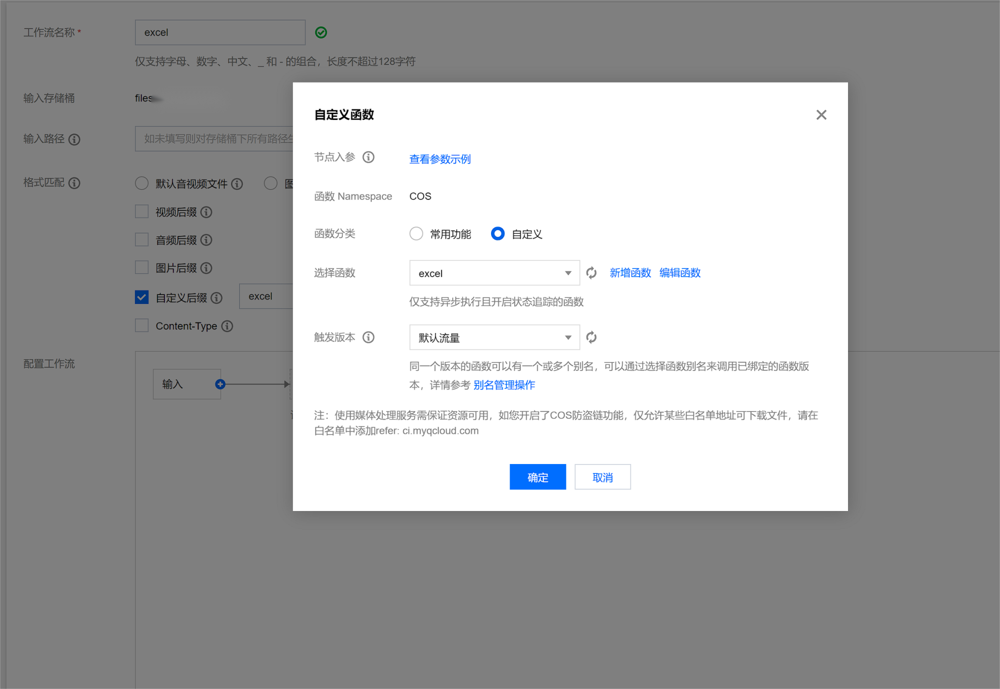

---
layout:
  title:
    visible: true
  description:
    visible: false
  tableOfContents:
    visible: true
  outline:
    visible: true
  pagination:
    visible: true
---

# Serverless

[](https://github.com/weplanx/fn/actions/workflows/release.yml)[](https://github.com/weplanx/fn/releases)[](https://github.com/weplanx/fn)[](https://goreportcard.com/report/github.com/weplanx/fn)[](https://raw.githubusercontent.com/weplanx/fn/main/LICENSE)

Data workflow serverless function for object storage processing, the main container mirroring is:

* ghcr.io/weplanx/fn:latest
* registry.cn-shenzhen.aliyuncs.com/weplanx/fn:latest
* ccr.ccs.tencentyun.com/weplanx/fn:latest

## Environement

### ADDRESS

* Listening address, default `:9000`

### PROCESS <mark style="color:red;">\*required</mark>

* process
  * **tencent-cos-excel** Tencent Cloud COS Excel Processing

### COS\_URL

* Tencent Cloud COS Address

### COS\_SECRETID

* Secret ID

### COS\_SECRETKEY

* Secret Key

## 腾讯云示例

云函数为例：

* 选择使用容器镜像，<mark style="color:red;">\*工作流方式函数服务需要在 COS 命名空间创建</mark>
* 函数类型：事件函数
* 函数名称：自定
* 镜像：ccr.ccs.tencentyun.com/weplanx/fn:\[version]
* 镜像类型：Web Server 镜像
* 内存：按情况需求
* 环境变量：
  * `PROCESS=tencent-cos-excel`
  * 配置私有的 `COS_URL` `COS_SECRETID` `COS_SECRETKEY`
* 执行配置：<mark style="color:red;">\*工作流方式必须启用异步执行、状态追踪</mark>

<figure><figcaption></figcaption></figure>

### 方式一：COS 触发

部署完成后，至该函数的【触发管理】

* 触发方式：COS 触发
* COS Bucket：选择对应 Bucket
* 事件类型：全部创建
* 后缀过滤：`.excel`

<figure><figcaption></figcaption></figure>

### 方式二：工作流

适合多重处理需自定回调的复杂场景，到对应的 COS 存储桶中，先确认【数据处理】->【媒体处理】是否开启（需要开启）

<figure><figcaption></figcaption></figure>

再跳转至【任务与工作流】->【工作流管理】，创建工作流

* 工作流名称：自定
* 匹配规则：自定义规则
  * 自定义后缀：excel
* 增加一个自定义函数输入，选择刚才建立的云函数，如图
* 回调方式：启用并自定义处理事件

<figure><figcaption></figcaption></figure>

创建完成后启用上传触发执行

## Client

For applications to perform related functions

```shell
go get github.com/weplanx/fn
```

### Initialize

```go
// Create the fn client
x, err = fn.New(
    fn.SetCos(values.Cos.Url, values.Cos.SecretId, values.Cos.SecretKey),
)
```

### Upload pack to COS and asynchronous conversion Excel

```go
data := [][]interface{}{
    {"Name", "CCType", "CCNumber", "Century", "Currency", "Date", "Email", "URL"},
}
for n := 0; n < 10; n++ {
    data = append(data, []interface{}{
        faker.Name(), faker.CCType(), faker.CCNumber(), faker.Century(), faker.Currency(), faker.Date(), faker.Email(), faker.URL(),
    })
}
ctx := context.TODO()
err := x.TencentCosExcel(ctx, "test", map[string][][]interface{}{
    "Sheet1": data,
})
```

## License

[BSD-3-Clause License](https://github.com/weplanx/fn/blob/main/LICENSE)
