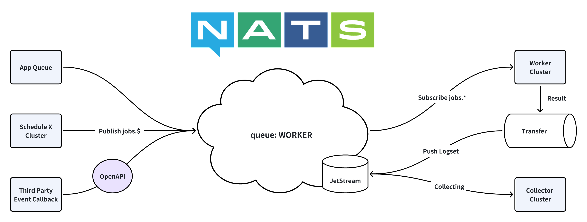

---
layout:
  title:
    visible: true
  description:
    visible: false
  tableOfContents:
    visible: true
  outline:
    visible: true
  pagination:
    visible: true
---

# Worker

[](https://github.com/weplanx/worker/actions/workflows/release.yml)[](https://github.com/weplanx/worker/releases)[](https://github.com/weplanx/worker)[](https://goreportcard.com/report/github.com/weplanx/worker)[](https://raw.githubusercontent.com/weplanx/worker/main/LICENSE)

Distribution message event callback worker node

## Pre-requisite

* Nats cluster needs to enable JetStream
* Services and applications should work together the same nats tenant

## Deploy

The worker node subscribes to the work queue (non-persistent), including events from Schdule, MQ (message queue) and third-party. The node that gets the message triggers the event and transfers the result to the data stream. Node support horizontal expansion shunt pressure.

<figure><figcaption></figcaption></figure>

The main container image is:

* ghcr.io/weplanx/worker:latest
* registry.cn-shenzhen.aliyuncs.com/weplanx/worker:latest

The case will use Kubernetes deployment orchestration, replicate deployment (modify as needed).

```yaml
apiVersion: apps/v1
kind: Deployment
metadata:
  name: worker
spec:
  selector:
    matchLabels:
      app: worker
  template:
    metadata:
      labels:
        app: worker
    spec:
      containers:
        - image: registry.cn-shenzhen.aliyuncs.com/weplanx/worker:latest
          imagePullPolicy: Always
          name: worker
          env:
            - name: MODE
              value: release
            - name: NATS_HOSTS
              value: <*** your nats hosts ***>
            - name: NATS_NKEY
              value: <*** your nats nkey***>
```

## Environement

### MODE

* Working mode, default `debug`

### NATS\_HOSTS <mark style="color:red;">\*required</mark>

* Nats connection host, use `,` split

### NATS\_NKEY <mark style="color:red;">\*required</mark>

* Nats NKEY authentication

## License

[BSD-3-Clause License](https://github.com/weplanx/worker/blob/main/LICENSE)
