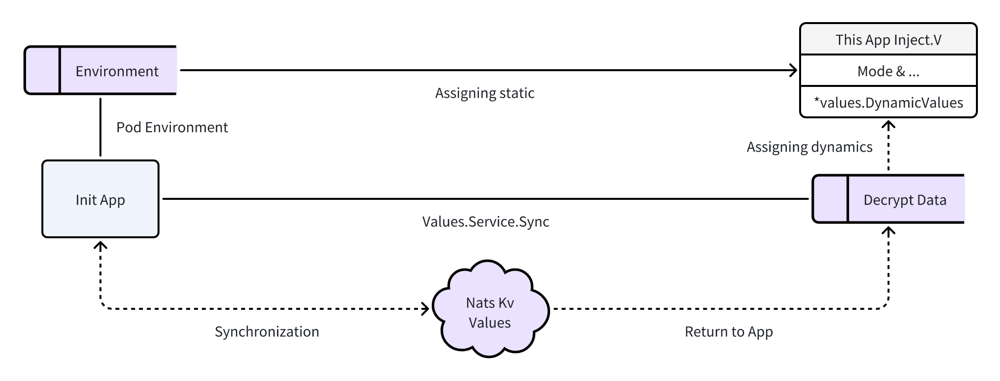
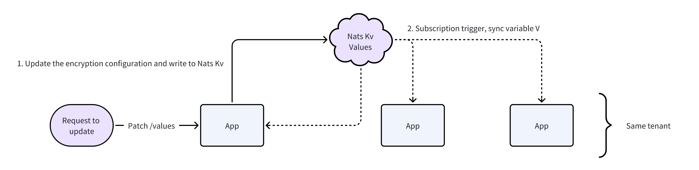

# Configurations

Each configuration item is assigned to the variable Values of the backend service.

In addition, when dynamic configuration is published, each node with the same namespace will automatically sync up the variable Values.

<figure><figcaption></figcaption></figure>

## Environement

### MODE

* Working mode, default `debug`

### HOSTNAME

* Host, the default is the hostname of the pod

### ADDRESS

* Listening address, default `:3000`
* XAPI recommends setting `:6000`，OpenAPI recommends setting `:9000`

### CONSOLE <mark style="color:red;">\*required</mark>

* Public address of the front end
* For example: https://console.developer.com

### IP

* Customize the header to get the IP, default `X-Forwarded-For`
* For example: after CDN, WAF, etc. back to the source Kubernetes the original "X-Forwarded-For" will lose the real IP coverage

### XDOMAIN

* Customized XSRF Cookie Domain Names
* For example: solve the problem that XSRF Token cannot be obtained due to the separation of the front and back ends

### NAMESPACE <mark style="color:red;">\*required</mark>

* Namespace, it's unique within the same Nats tenant, DevOps defaults to `weplanx` tenant

### KEY \*required

* App key for signing, data encryption, etc

### DATABASE\_URL <mark style="color:red;">\*required</mark>

* MongoDB connection address

### DATABASE\_NAME <mark style="color:red;">\*required</mark>

* MongoDB database name

### DATABASE\_REDIS <mark style="color:red;">\*required</mark>

* Redis connection address

### NATS\_HOSTS <mark style="color:red;">\*required</mark>

* Nats connection host, use `,` split

### NKEY\_NKEY <mark style="color:red;">\*required</mark>

* Nats NKEY authentication

### INFLUX\_URL <mark style="color:red;">\*required</mark>

* InfluxDB connection address

### INFLUX\_ORG <mark style="color:red;">\*required</mark>

* Organization naming for InfluxDB

### INFLUX\_TOKEN <mark style="color:red;">\*required</mark>

* Authorized Token for InfluxDB

### INFLUX\_BUCKET <mark style="color:red;">\*required</mark>

* InfluxDB bucket

### OTLP\_ENDPOINT <mark style="color:red;">\*required</mark>

* OpenTelemetry ENDPOINT

### OTLP\_TOKEN <mark style="color:red;">\*required</mark>

* OpenTelemetry TOKEN

## Dynamic

Dynamic configuration is based on the Nats KeyValue implementation, which is the core of supporting distribution application configuration sync up.

Data stores are encrypted, but allow deciphers to return after authentication.

* <mark style="color:red;">\*secret</mark> This part of the field will not be returned in its entirety, and it means it is not empty when returning `*`.

<figure><figcaption></figcaption></figure>


Define the configuration file _default.values.yml_, and use **Snake Case** for the configuration name.


### SessionTTL

* `time.Duration` Session period, default `1h`
* For example: how many seconds of session contract renewal in the operation

### LoginTTL

* `time.Duration` Login failed lock duration, default `15m`

### LoginFailures

* `int64` Maximum number of consecutive login failures, default `5`

### IpLoginFailures

* `int64` The maximum number of consecutive login failures with IP, default `10`

### IpWhitelist

* `[]string` IP Whitelist

### IpBlacklist

* `[]string` IP Blacklist

### PwdStrategy

* `int` Password strength policy
  * `0` Unlimited
  * `1` Uppercase and lowercase letters
  * `2` Uppercase and lowercase letters, numbers
  * `3` Uppercase and lowercase letters, numbers, special characters

### PwdTTL

* `time.Duration` Password valid period，`0` permanent

### Cloud

* `string` Public cloud platform
  * `tencent` Tencent Cloud
  * `aliyun` Alibaba Cloud
  * `aws` Amazon Cloud

### TencentSecretId

* `string` Secret ID of Tencent Cloud
* It is recommended to create a CAM subuser for this app and authorize the minimum permissions required

### TencentSecretKey <mark style="color:red;">\*secret</mark>

* `string` Secret Key of Tencent Cloud

### TencentCosBucket

* `string` Bucket of Tencent Cloud COS

### TencentCosRegion

* `string` COS Region

### TencentCosExpired

* `int64` Presignature valid period in seconds

### TencentCosLimit

* `int64` Upload size limit

### Collaboration

* `string` Office collaboration platform
  * `lark` Lark or Feishu

### LarkAppId

* `string` App ID of Lark & Feishu

### LarkAppSecret <mark style="color:red;">\*secret</mark>

* `string` App Secret of Lark & Feishu

### LarkEncryptKey <mark style="color:red;">\*secret</mark>

* `string` Encrypt Key of Lark & Feishu

### LarkVerificationToken <mark style="color:red;">\*secret</mark>

* `string` Verification Token of Lark & Feishu

### RedirectUrl

* `string` Third-party redirect address

### EmailHost

* `string` Public Email SMTP Address

### EmailPort

* `int` Public Email SMTP port number (SSL), default `465`

### EmailUsername

* `string` Public Email User

### EmailPassword <mark style="color:red;">\*secret</mark>

* `string` Public Email Password

### ApiGatewayUrl

* `string` API Gateway Address

### ApiGatewayKey

* `string` Key of API Gateway Application
* Example: Tencent Cloud API Gateway [Authentication](https://cloud.tencent.com/document/product/628/55088)

### ApiGatewaySecret <mark style="color:red;">\*secret</mark>

* `string` Secret of API Gateway Application

### RestControls

* `map[string]*RestControl` Dynamic configuration of Mongo Rest
* RestControl
  * **Keys** `[]string` Projection
  * **Sensitives** `[]string` Desensitization
  * **Status** `bool` Allow access
  * **Event** `bool` Event callbacks

### RestTxnTimeout

* `time.Duration` Transaction suspend valid period, default `3m`

## Extended Dynamic

Weplanx/server also extends other configurations, which are not required if other applications are customized:

### IpAddress

* `string` Address to get IPv4 details
* Currently using Tencent Cloud Market [数链云](https://market.cloud.tencent.com/products/38618)
  * The log set is marked as `metadata.version: shuliancloud.v4`

### IpSecretId

* `string` Get Secret ID of IPv4 details

### IpSecretKey <mark style="color:red;">\*secret</mark>

* `string` Get Secret Key for IPv4 Details

### Ipv6Address

* `string` Address to get IPv6 details
* Currently using Tencent Cloud Market [数链云](https://market.cloud.tencent.com/products/38620)
  * The log set is marked as `metadata.version: shuliancloud.v4`

### Ipv6SecretId

* `string` Get Secret ID of IPv6 details

### Ipv6SecretKey <mark style="color:red;">\*secret</mark>

* `string` Get Secret Key for IPv6 Details

### SmsSecretId

* `string` Secret ID of Tencent Cloud [SMS](https://cloud.tencent.com/document/product/382/37745)

### SmsSecretKey <mark style="color:red;">\*secret</mark>

* `string` Secret of Tencent Cloud SMS

### SmsSign

* `string` Sign of Tencent Cloud SMS

### SmsAppId

* `string` App ID of Tencent Cloud SMS

### SmsRegion

* `string` Region of Tencent Cloud SMS

### SmsPhoneBind

* `string` Template ID for mobile binding of Tencent Cloud SMS

### SmsLoginVerify

* `string` Template ID for login of Tencent Cloud SMS

### EmqxHost

* `string` [EMQX API](https://www.emqx.io/docs/zh/v5.1/admin/api-docs.html) Host

### EmqxApiKey

* `string` Key of EMQX API

### EmqxSecretKey <mark style="color:red;">\*secret</mark>

* `string` Secret Key of EMQX API

### AccelerateAddress

* `string` Address of accelerate function of Tencent Cloud SCF
* International network not required

### CamUin

* `string` Tencent cloud main account ID
