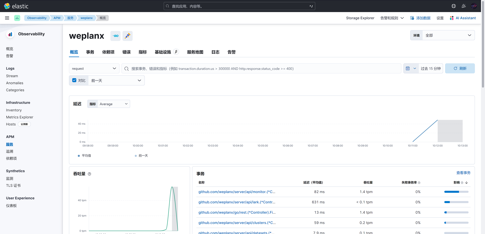

---
layout:
  title:
    visible: true
  description:
    visible: false
  tableOfContents:
    visible: true
  outline:
    visible: true
  pagination:
    visible: true
---

# Enable APM

Weplanx adopts [Elastic Cloud on Kubernetes](https://www.elastic.co/guide/en/cloud-on-k8s/current/k8s-overview.html) for full-text index and APM Observability, Whether using self-host or public cloud, CRDS is first added to the application cluster.

```shell
# https://www.elastic.co/guide/en/cloud-on-k8s/current/k8s-deploy-eck.html

kubectl create -f https://download.elastic.co/downloads/eck/2.9.0/crds.yaml
```

## Apply APM Server

If it is a self-host ECK, you can directly associate internal elasticsearch with kibana, for example.

```yaml
# https://www.elastic.co/guide/en/cloud-on-k8s/current/k8s-apm-eck-managed-es.html

apiVersion: apm.k8s.elastic.co/v1
kind: ApmServer
metadata:
  name: weplanx
  namespace: elastic-system
spec:
  version: 8.10.3
  count: 1
  config:
    apm-server:
      host: "0.0.0.0:8200"
      rum:
        enabled: true
      expvar:
        enabled: true
  http:
    tls:
      selfSignedCertificate:
        disabled: true
  podTemplate:
    spec:
      affinity:
        nodeAffinity:
          requiredDuringSchedulingIgnoredDuringExecution:
            nodeSelectorTerms:
              - matchExpressions:
                  - key: kubernetes.io/hostname
                    operator: NotIn
                    values:
                      - main
  elasticsearchRef:
    name: elasticsearch
  kibanaRef:
    name: kibana
```

If connecting from extranet it can be

```yaml
apiVersion: apm.k8s.elastic.co/v1
kind: ApmServer
metadata:
  name: weplanx
  namespace: elastic-system
spec:
  version: 8.10.3
  count: 1
  config:
    apm-server:
      host: "0.0.0.0:8200"
      rum:
        enabled: true
      expvar:
        enabled: true
      kibana:
        enabled: true
        host: https://kibana.xxx.com:5601
    output:
      elasticsearch:
        hosts: [ "https://elastic.xxx.com:9200" ]
        username: xxx
        password: xxx
        protocol: "https"
  http:
    tls:
      selfSignedCertificate:
        disabled: true
```

Get APM TOKEN

```shell
# https://www.elastic.co/guide/en/cloud-on-k8s/current/k8s-apm-connecting.html

kubectl get secret/weplanx-apm-token -o go-template='{{index .data "secret-token" | base64decode}}' -n elastic-system
```

Each creation automatically generates a new key and service to plug into the application OpenTelemetry

* **MODE** `release` APM Environment
* **OTLP\_ENDPOINT** `weplanx-apm-http.elastic-system.svc:8200`
* **OTLP\_TOKEN** `<*** APM TOKEN ***>`

Finally, the APM integration must be enabled in kibana, and the access is successful.

<figure><figcaption></figcaption></figure>
