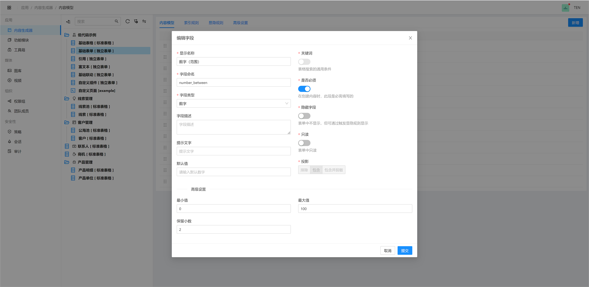

# LowCode

<figure><figcaption></figcaption></figure>

<figure><figcaption>
Edit Form
</figcaption></figure>

<figure><figcaption>
Content Presentation
</figcaption></figure>

<figure><figcaption>
Generated Page
</figcaption></figure>
